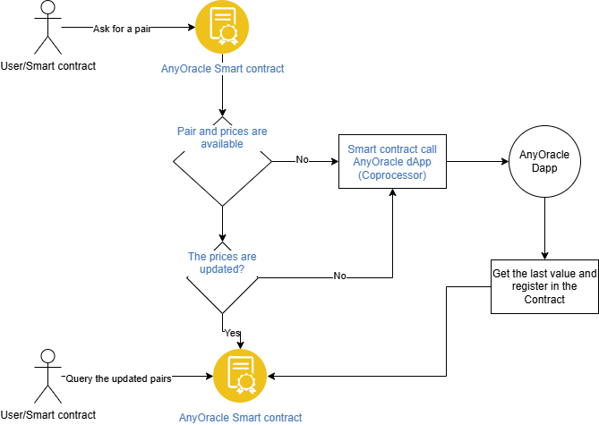

# AnyOracle
**AnyOracle** is an Oracle protocol built with [Cartesi Coprocessor](https://docs.mugen.builders/cartesi-co-processor-tutorial/introduction). With AnyOracle, you can ask for any cryptocurrency rate from Coingecko using the economic security from [EigenLayer](https://www.eigenlayer.xyz/) thanks for Cartesi Coprocessor.

With AnyOracle, you just need to query a specific pair (for example: bitcoin to usd, or ethereum to eur), without depending of many smart contracts, just one.

You can use **AnyOracle** in your dApps with some few steps. 

## Flow

## How works? 

1. Any user or smart contract can query for a pair (according to Coingecko rules, for example, cryptocurrencies do not use the ticker, but the name, like _bitcoin_ instead of _btc_). For this, the getRate() function is called specifying the base asset and the quote asset.
2. The function's response can return a structure, which incorporates, in addition to the assets, the value field (the value of the pair), and the block number in which the value was created/updated.
3. If there is no value or it is old (many blocks old), the user/smart contract/dApp can call the runExecution function, which in turn will call the dApp to execute the pair calculation using the Coingecko API.
4. If a value is successfully obtained, this value is sent to the contract for storage.
5. The user can now query the value again and should get the latest available value.

## How use it?

1. Install all the dependencies and apps from Cartesi Coprocessor: https://docs.mugen.builders/cartesi-co-processor-tutorial/installation
2. Get a free API Key from Congecko.
3. Update the environment in the [docker file for the dApp](./anyoracle-dapp/Dockerfile) with the API key.
4. Deploy the project in devnet, testnet or mainnet using [Cartesi Coprocessor CLI](https://docs.mugen.builders/cartesi-co-processor-tutorial/running)

## Components

- [Smart contract](./anyoracle-dapp/): It contains the base contract to call and receive information from the dApp and Coprocessor.
- [dApp](./anyoracle-dapp/): It is the backend with the logic, calling the coingeko API and using Cartesi and Docker.